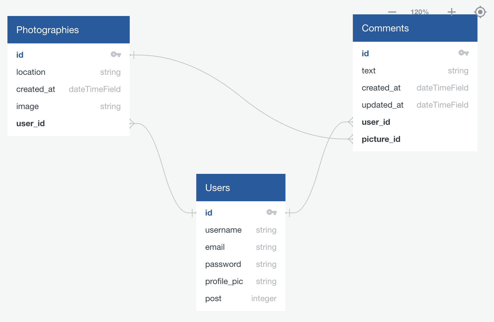

# General Assembly SEI-49 | Project 4 - APPerture 

## Technical brief
* **Build a full-stack application** by making your own Backend and Frontend.
* **Use a Python Django API** using Django REST Framework to serve your data from a Postgres database. 
* **Consume your API with a separate Frontend** built with React.
* **Submit a complete app** with multiple relationships and CRUD functionalities.
* **Implement thoughtful user diagrams/wireframes** that help plan which features are core MVP.
* **Deploy your app online.**  Make it publicly accessible.  
* **React Hooks** is optional for this project.
* **Time Frame**: 7 days.
* **Optional:** Choice of doing it individual or in a group.
---
## Technologies:
* HTML5
* SCSS & Bootstrap
* Material UI
* DjangoDB REST Framework
* Python
* ReactJS
* JavaScript (ES6)
* Insomnia
* TablePlus
* Quick Database Diagrams
* Miro
* Trello Board
---
## Overview
* The App is hosted [here]()
* Else, kindly clone or fork the repository: 
	*	To install all the packages listed in the package.json: —> `npm i`   
	* Navigate into the shell -> `pipenv shell` 
	* Run the app on localhost:8000 : —> `python manage.py runserver `
	* Check the console for any issues and if there are any then check the `package.json` for any dependancies missing —>  
	* Navigate to [http://localhost:8000/](http://localhost:8000/)
	* Open the frontend `code frontend` in your terminal
	* Type `npm i` in your terminal to dl dependencies then `npm start`
 
 

**We chose to work in a pair** because our previous project raised the difficulties to work in group which is a point we wanted to be prepared for.  Therefore, we decided to exposed ourselves to the market reality and the collaboration requirements.  Subsequently, the planning and attribution of tasks was essential to us which allowed to keep this project objectives clear.
 

 